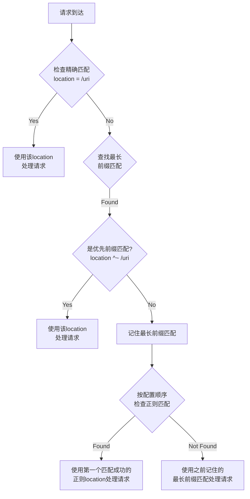

# Nginx location指令解析逻辑

## 目录

- [1. location指令概述](#1-location指令概述)
- [2. location指令的语法](#2-location指令的语法)
- [3. location指令的解析过程](#3-location指令的解析过程)
  - [3.1 配置解析阶段](#31-配置解析阶段)
  - [3.2 添加location到locations队列](#32-添加location到locations队列)
  - [3.3 构建location树](#33-构建location树)
- [4. 请求处理阶段的location匹配](#4-请求处理阶段的location匹配)
  - [4.1 静态location匹配](#41-静态location匹配)
  - [4.2 正则location匹配](#42-正则location匹配)
- [5. location指令的匹配优先级](#5-location指令的匹配优先级)
- [6. 命名location](#6-命名location)
- [7. 实际配置示例](#7-实际配置示例)
- [8. 正则匹配详解](#8-正则匹配详解)
- [9. location匹配流程图](#9-location匹配流程图)
- [10. 常见陷阱和最佳实践](#10-常见陷阱和最佳实践)
- [11. 总结](#11-总结)

## 1. location指令概述

location指令是Nginx中最重要的指令之一，用于根据请求的URI来匹配不同的配置块，从而实现不同的处理逻辑。location指令可以嵌套使用，并且支持多种匹配方式。

在Nginx的源代码中，location指令定义在`ngx_http_core_module.c`文件中的`ngx_http_core_commands`数组中：

```c
{ ngx_string("location"),
  NGX_HTTP_SRV_CONF|NGX_HTTP_LOC_CONF|NGX_CONF_BLOCK|NGX_CONF_TAKE12,
  ngx_http_core_location,
  NGX_HTTP_SRV_CONF_OFFSET,
  0,
  NULL }
```

这个定义表明：
- location指令可以出现在server块和location块中
- 它是一个块指令（`NGX_CONF_BLOCK`）
- 它可以接受1或2个参数（`NGX_CONF_TAKE12`）
- 它的处理函数是`ngx_http_core_location`

## 2. location指令的语法

location指令的语法有以下几种形式：

1. **精确匹配**：`location = /uri { ... }`
   - 要求请求的URI与配置的路径完全相同，不会匹配目录内的文件
   - 例如：`location = /docs` 只会匹配 `/docs`，不会匹配 `/docs/` 或 `/docs/index.html`
2. **优先前缀匹配**：`location ^~ /uri { ... }`
   - 类似于前缀匹配，但优先级更高，匹配后不再检查正则表达式
   - 会匹配目录内的文件，例如：`location ^~ /docs` 会匹配 `/docs/index.html`
3. **正则匹配（区分大小写）**：`location ~ pattern { ... }`
4. **正则匹配（不区分大小写）**：`location ~* pattern { ... }`
5. **前缀匹配**：`location /uri { ... }`
   - 匹配以指定前缀开头的URI，包括目录内的所有文件
   - 例如：`location /docs` 会匹配 `/docs`、`/docs/`、`/docs/index.html` 等
6. **命名location**：`location @name { ... }`

## 3. location指令的解析过程

### 3.1 配置解析阶段

在Nginx启动时，会解析配置文件，当遇到location指令时，会调用`ngx_http_core_location`函数进行处理。这个函数的主要工作是：

1. 创建一个新的配置上下文（`ngx_http_conf_ctx_t`）
2. 为每个HTTP模块创建location级别的配置结构体
3. 解析location指令的参数，确定匹配类型和URI
4. 将location配置添加到父配置的locations队列中
5. 解析location块内的配置指令

```c
static char *
ngx_http_core_location(ngx_conf_t *cf, ngx_command_t *cmd, void *dummy)
{
    // 创建配置上下文和为每个模块创建配置结构体

    // 解析location指令的参数
    if (cf->args->nelts == 3) {
        // 有修饰符的形式：location ~ /uri
        len = value[1].len;
        mod = value[1].data;
        name = &value[2];

        if (len == 1 && mod[0] == '=') {
            // 精确匹配：location = /uri
            clcf->name = *name;
            clcf->exact_match = 1;
        } else if (len == 2 && mod[0] == '^' && mod[1] == '~') {
            // 优先前缀匹配：location ^~ /uri
            clcf->name = *name;
            clcf->noregex = 1;
        } else if (len == 1 && mod[0] == '~') {
            // 正则匹配（区分大小写）：location ~ pattern
            if (ngx_http_core_regex_location(cf, clcf, name, 0) != NGX_OK) {
                return NGX_CONF_ERROR;
            }
        } else if (len == 2 && mod[0] == '~' && mod[1] == '*') {
            // 正则匹配（不区分大小写）：location ~* pattern
            if (ngx_http_core_regex_location(cf, clcf, name, 1) != NGX_OK) {
                return NGX_CONF_ERROR;
            }
        } else {
            // 无效的修饰符
            ngx_conf_log_error(NGX_LOG_EMERG, cf, 0,
                               "invalid location modifier \"%V\"", &value[1]);
            return NGX_CONF_ERROR;
        }
    } else {
        // 没有修饰符的形式：location /uri
        name = &value[1];

        if (name->data[0] == '=') {
            // 精确匹配的简写形式：location =/uri
            clcf->name.len = name->len - 1;
            clcf->name.data = name->data + 1;
            clcf->exact_match = 1;
        } else if (name->data[0] == '^' && name->data[1] == '~') {
            // 优先前缀匹配的简写形式：location ^~/uri
            clcf->name.len = name->len - 2;
            clcf->name.data = name->data + 2;
            clcf->noregex = 1;
        } else if (name->data[0] == '~') {
            // 正则匹配的简写形式
            name->len--;
            name->data++;

            if (name->data[0] == '*') {
                // 不区分大小写：location ~*pattern
                name->len--;
                name->data++;
                if (ngx_http_core_regex_location(cf, clcf, name, 1) != NGX_OK) {
                    return NGX_CONF_ERROR;
                }
            } else {
                // 区分大小写：location ~pattern
                if (ngx_http_core_regex_location(cf, clcf, name, 0) != NGX_OK) {
                    return NGX_CONF_ERROR;
                }
            }
        } else {
            // 普通前缀匹配：location /uri
            clcf->name = *name;

            if (name->data[0] == '@') {
                // 命名location：location @name
                clcf->named = 1;
            }
        }
    }

    // 检查嵌套location的合法性

    // 添加location到父配置的locations队列
    if (ngx_http_add_location(cf, &pclcf->locations, clcf) != NGX_OK) {
        return NGX_CONF_ERROR;
    }

    // 解析location块内的配置指令
    save = *cf;
    cf->ctx = ctx;
    cf->cmd_type = NGX_HTTP_LOC_CONF;
    rv = ngx_conf_parse(cf, NULL);
    *cf = save;

    return rv;
}
```

### 3.2 添加location到locations队列

在解析完location指令后，会调用`ngx_http_add_location`函数将location配置添加到父配置的locations队列中：

```c
ngx_int_t
ngx_http_add_location(ngx_conf_t *cf, ngx_queue_t **locations,
    ngx_http_core_loc_conf_t *clcf)
{
    ngx_http_location_queue_t  *lq;

    // 初始化locations队列
    if (*locations == NULL) {
        *locations = ngx_palloc(cf->temp_pool,
                                sizeof(ngx_http_location_queue_t));
        if (*locations == NULL) {
            return NGX_ERROR;
        }

        ngx_queue_init(*locations);
    }

    // 创建location队列项
    lq = ngx_palloc(cf->temp_pool, sizeof(ngx_http_location_queue_t));
    if (lq == NULL) {
        return NGX_ERROR;
    }

    // 根据location类型设置exact或inclusive
    if (clcf->exact_match || clcf->regex || clcf->named || clcf->noname) {
        lq->exact = clcf;
        lq->inclusive = NULL;
    } else {
        lq->exact = NULL;
        lq->inclusive = clcf;
    }

    // 设置location名称和文件信息
    lq->name = &clcf->name;
    lq->file_name = cf->conf_file->file.name.data;
    lq->line = cf->conf_file->line;

    // 将location队列项添加到locations队列中
    ngx_queue_init(&lq->list);
    ngx_queue_insert_tail(*locations, &lq->queue);

    return NGX_OK;
}
```

### 3.3 构建location树

在Nginx完成配置解析后，会调用`ngx_http_init_locations`函数将locations队列转换为一个树形结构，以便在请求处理阶段快速查找匹配的location：

1. 首先，将locations队列按照名称长度排序
2. 然后，将排序后的locations队列转换为一个树形结构
3. 最后，将正则location单独存储在一个数组中

这样，在请求处理阶段，Nginx可以先查找静态location树，如果没有找到精确匹配，再尝试正则location。

## 4. 请求处理阶段的location匹配

在请求处理阶段，Nginx会调用`ngx_http_core_find_location`函数来查找匹配的location：

```c
static ngx_int_t
ngx_http_core_find_location(ngx_http_request_t *r)
{
    ngx_int_t                  rc;
    ngx_http_core_loc_conf_t  *pclcf;
#if (NGX_PCRE)
    ngx_int_t                  n;
    ngx_uint_t                 noregex;
    ngx_http_core_loc_conf_t  *clcf, **clcfp;

    noregex = 0;
#endif

    pclcf = ngx_http_get_module_loc_conf(r, ngx_http_core_module);

    // 先查找静态location树
    rc = ngx_http_core_find_static_location(r, pclcf->static_locations);

    if (rc == NGX_AGAIN) {
        // 如果是包含匹配，继续查找嵌套location
#if (NGX_PCRE)
        clcf = ngx_http_get_module_loc_conf(r, ngx_http_core_module);
        noregex = clcf->noregex;
#endif
        rc = ngx_http_core_find_location(r);
    }

    if (rc == NGX_OK || rc == NGX_DONE) {
        return rc;
    }

    // 如果静态location没有匹配，尝试正则location
#if (NGX_PCRE)
    if (noregex == 0 && pclcf->regex_locations) {
        for (clcfp = pclcf->regex_locations; *clcfp; clcfp++) {
            n = ngx_http_regex_exec(r, (*clcfp)->regex, &r->uri);
            if (n == NGX_OK) {
                r->loc_conf = (*clcfp)->loc_conf;
                // 继续查找嵌套location
                rc = ngx_http_core_find_location(r);
                return (rc == NGX_ERROR) ? rc : NGX_OK;
            }
            if (n == NGX_DECLINED) {
                continue;
            }
            return NGX_ERROR;
        }
    }
#endif

    return rc;
}
```

### 4.1 静态location匹配

静态location匹配由`ngx_http_core_find_static_location`函数完成，它会在location树中查找最匹配的location：

```c
static ngx_int_t
ngx_http_core_find_static_location(ngx_http_request_t *r,
    ngx_http_location_tree_node_t *node)
{
    u_char     *uri;
    size_t      len, n;
    ngx_int_t   rc, rv;

    len = r->uri.len;
    uri = r->uri.data;

    rv = NGX_DECLINED;

    for ( ;; ) {
        if (node == NULL) {
            return rv;
        }

        n = (len <= (size_t) node->len) ? len : node->len;
        rc = ngx_filename_cmp(uri, node->name, n);

        if (rc != 0) {
            node = (rc < 0) ? node->left : node->right;
            continue;
        }

        if (len > (size_t) node->len) {
            if (node->inclusive) {
                r->loc_conf = node->inclusive->loc_conf;
                rv = NGX_AGAIN;
                node = node->tree;
                uri += n;
                len -= n;
                continue;
            }
            // 只有精确匹配
            node = node->right;
            continue;
        }

        if (len == (size_t) node->len) {
            if (node->exact) {
                r->loc_conf = node->exact->loc_conf;
                return NGX_OK;
            } else {
                r->loc_conf = node->inclusive->loc_conf;
                return NGX_AGAIN;
            }
        }

        // len < node->len
        node = node->left;
    }
}
```

从代码中可以看出，精确匹配的判断条件是：

```c
if (len == (size_t) node->len) {
    if (node->exact) {
        r->loc_conf = node->exact->loc_conf;
        return NGX_OK;  // 精确匹配成功
    } else {
        r->loc_conf = node->inclusive->loc_conf;
        return NGX_AGAIN;
    }
}
```

这里的关键是`len == (size_t) node->len`，它要求请求URI的长度必须与location路径的长度完全相同，并且前面的比较`ngx_filename_cmp(uri, node->name, n)`确保了内容也完全相同。

这就是为什么精确匹配不会匹配目录内文件的原因。例如，对于`location = /docs`：
- 请求`/docs`的URI长度与location路径长度相同，内容也相同，所以能匹配
- 请求`/docs/index.html`的URI长度大于location路径长度，所以不能匹配

而对于前缀匹配`location /docs`，当请求URI的长度大于location路径长度时，会进入以下分支：

```c
if (len > (size_t) node->len) {
    if (node->inclusive) {
        r->loc_conf = node->inclusive->loc_conf;
        rv = NGX_AGAIN;
        // ...
    }
    // ...
}
```

这就是为什么前缀匹配可以匹配目录内文件的原因。

匹配结果的含义：
- `NGX_OK`：精确匹配
- `NGX_DONE`：自动重定向
- `NGX_AGAIN`：包含匹配
- `NGX_DECLINED`：没有匹配

### 4.2 正则location匹配

如果静态location没有找到精确匹配，Nginx会尝试正则location匹配。正则location按照它们在配置文件中出现的顺序依次尝试，第一个匹配成功的正则location将被使用。

## 5. location指令的匹配优先级

Nginx location指令的匹配优先级从高到低为：

1. 精确匹配：`location = /uri`
2. 优先前缀匹配：`location ^~ /uri`
3. 正则匹配：`location ~ pattern` 或 `location ~* pattern`
4. 普通前缀匹配：`location /uri`

在实际匹配过程中：
1. 首先查找精确匹配，如果找到则立即使用
2. 如果没有精确匹配，查找最长的前缀匹配
   - 如果最长的前缀匹配是优先前缀匹配（^~），则立即使用
   - 否则，记住这个最长的前缀匹配，继续查找正则匹配
3. 按照配置文件中的顺序尝试正则匹配，第一个匹配成功的正则location将被使用
4. 如果没有正则匹配成功，则使用之前记住的最长前缀匹配

## 6. 命名location

命名location是一种特殊的location，它以`@`开头，不能直接匹配请求，只能通过内部重定向（如`error_page`、`try_files`或`rewrite`指令）来访问。

命名location的查找由`ngx_http_named_location`函数完成：

```c
ngx_int_t
ngx_http_named_location(ngx_http_request_t *r, ngx_str_t *name)
{
    // 获取server配置
    cscf = ngx_http_get_module_srv_conf(r, ngx_http_core_module);

    // 在server的named_locations中查找匹配的命名location
    for (clcfp = cscf->named_locations; clcfp && *clcfp; clcfp++) {
        if ((*clcfp)->name.len == name->len
            && ngx_strncmp((*clcfp)->name.data, name->data, name->len) == 0)
        {
            // 找到匹配的命名location，设置请求的配置
            r->internal = 1;
            r->content_handler = NULL;
            r->uri_changed = 0;
            r->loc_conf = (*clcfp)->loc_conf;

            // 清除模块上下文
            ngx_memzero(r->ctx, sizeof(void *) * ngx_http_max_module);

            // 更新location配置
            ngx_http_update_location_config(r);

            // 重新开始请求处理
            cmcf = ngx_http_get_module_main_conf(r, ngx_http_core_module);
            r->phase_handler = cmcf->phase_engine.location_rewrite_index;
            r->write_event_handler = ngx_http_core_run_phases;
            ngx_http_core_run_phases(r);

            return NGX_DONE;
        }
    }

    // 没有找到匹配的命名location
    ngx_log_error(NGX_LOG_ERR, r->connection->log, 0,
                  "could not find named location \"%V\"", name);

    ngx_http_finalize_request(r, NGX_HTTP_INTERNAL_SERVER_ERROR);

    return NGX_DONE;
}
```

## 7. 实际配置示例

下面是一些常见的location配置示例，展示了不同匹配类型的用法：

```nginx
server {
    listen 80;
    server_name example.com;

    # 精确匹配 - 只匹配根路径
    location = / {
        return 200 '这是网站首页';
    }

    # 精确匹配 - 只匹配/api/status路径
    location = /api/status {
        return 200 '服务器状态正常';
    }

    # 优先前缀匹配 - 匹配所有/images/开头的请求，不再检查正则表达式
    location ^~ /images/ {
        root /var/www/static;
    }

    # 正则匹配 - 匹配所有图片文件
    location ~ \.(jpg|jpeg|png|gif)$ {
        root /var/www/images;
        expires 30d;
    }

    # 正则匹配（不区分大小写） - 匹配所有CSS和JS文件
    location ~* \.(css|js)$ {
        root /var/www/static;
        expires 1d;
    }

    # 普通前缀匹配 - 匹配所有/api/开头的请求
    location /api/ {
        proxy_pass http://backend_servers;
    }

    # 命名location - 只能通过内部重定向访问
    location @fallback {
        return 200 '这是备用处理程序';
    }

    # 默认处理 - 如果没有匹配到其他location
    location / {
        try_files $uri $uri/ @fallback;
    }
}
```

## 8. 正则匹配详解

Nginx的正则匹配使用PCRE库，支持大部分标准的正则表达式语法。正则location的处理有以下特点：

1. **区分大小写与不区分大小写**
   - `location ~ pattern` 区分大小写匹配
   - `location ~* pattern` 不区分大小写匹配

2. **按配置顺序匹配**
   - 正则location按照它们在配置文件中出现的顺序依次匹配
   - 第一个匹配成功的正则location将被使用

3. **常用正则表达式示例**
   - `\.html$` - 匹配以.html结尾的URI
   - `^/api/.*` - 匹配以/api/开头的所有URI
   - `\.(jpg|jpeg|png|gif)$` - 匹配常见图片文件

4. **捕获变量**
   - 可以使用正则表达式捕获变量，并在后续处理中使用
   - 例如：`location ~ ^/users/(.+)/profile$ { ... }`
   - 捕获的值可以通过`$1`, `$2`等变量访问

正则匹配的实现代码在`ngx_http_regex_exec`函数中，它使用PCRE库来执行正则表达式匹配。

## 9. location匹配流程图

下面是一个简化的Nginx location匹配流程图，展示了请求处理过程中如何选择匹配的location：



这个流程图清晰地展示了Nginx如何按照优先级顺序处理不同类型的location匹配。

## 10. 常见陷阱和最佳实践

### 常见陷阱

1. **忽略匹配优先级**
   - 错误地认为配置文件中的顺序决定了匹配优先级
   - 实际上，匹配类型决定了优先级，只有正则匹配会按配置顺序匹配

2. **忽略精确匹配的限制**
   - 错误地认为精确匹配会匹配目录内的文件
   - 实际上，精确匹配只匹配完全相同的URI

3. **嵌套location的错误使用**
   - 在精确匹配或命名location内嵌套其他location
   - Nginx不允许在这些类型的location内嵌套其他location

4. **路径规范化问题**
   - 忽略了路径末尾的斜杠对匹配的影响
   - `/docs`和`/docs/`是不同的路径，精确匹配会区分它们

### 最佳实践

1. **使用精确匹配处理特定请求**
   - 对于API端点或特定资源，使用精确匹配可以提高性能
   - 例如：`location = /favicon.ico { ... }`

2. **使用优先前缀匹配处理静态文件**
   - 对于静态文件目录，使用优先前缀匹配可以避免不必要的正则匹配
   - 例如：`location ^~ /static/ { ... }`

3. **合理组织正则匹配**
   - 将相关的正则匹配分组，并按照特定到通用的顺序排列
   - 更特定的正则匹配应该放在更通用的正则匹配之前

4. **使用命名location处理错误和回退逻辑**
   - 命名location可以用于集中处理错误和回退逻辑
   - 例如：`error_page 404 = @notfound;`

5. **避免过多的嵌套location**
   - 过多的嵌套location会增加配置复杂性和维护难度
   - 尽量使用正则匹配或前缀匹配来减少嵌套

## 11. 总结

Nginx的location指令是一个强大的功能，它允许根据请求的URI来匹配不同的配置块，从而实现不同的处理逻辑。location指令支持多种匹配方式，包括精确匹配、前缀匹配、正则匹配和命名location。

在Nginx的实现中，location指令的解析和匹配过程是非常精细的，它通过构建一个树形结构来实现高效的location查找。了解location指令的解析逻辑，有助于我们更好地配置和使用Nginx。

通过合理利用不同类型的location匹配和遵循最佳实践，可以构建高效、灵活且易于维护的Nginx配置。
